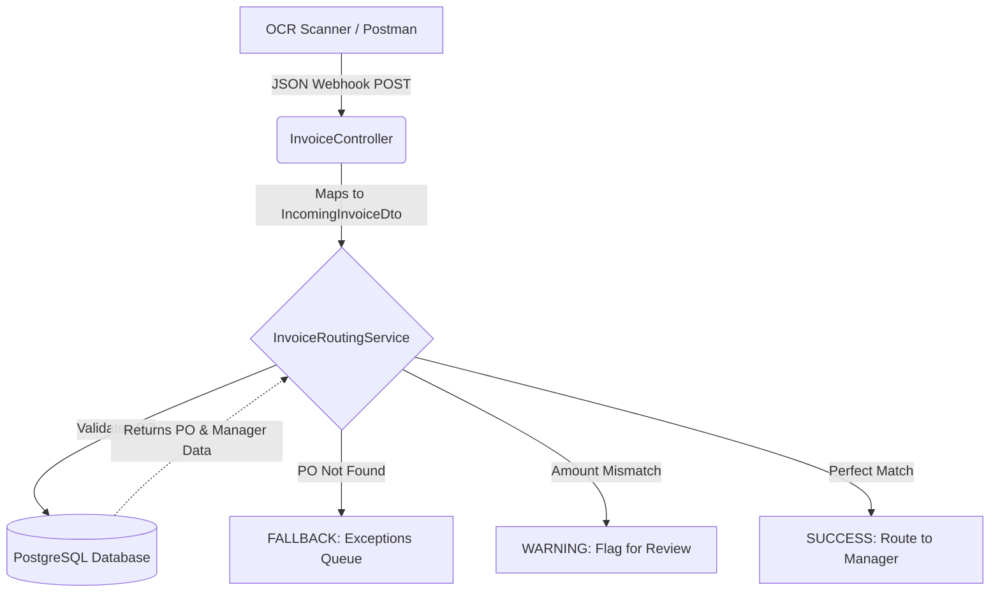

# 📦 Stampd - Automated Procure-to-Pay (P2P) Routing Engine (v1.0)

**Author:** Mateen Qureshi

## 🏢 The Analogy
Think of Stampd as a smart API gateway for enterprise cash flow, or a high-speed automated sorting machine in a mailroom. It intercepts raw, incoming packages (OCR invoice data), scans the barcode against our internal records (the Database), and instantly pushes the package down the correct conveyor belt—straight to the approving manager or into a reject bin.

## ⚙️ What It Does
Stampd is a headless routing engine that reduces the Procure-to-Pay cycle. It:
1. **Ingests** unstructured invoice metadata via a webhook (simulated by Postman).
2. **Validates** the data by executing deterministic 3-way matching logic against a mock ERP database.
3. **Routes** the approval by returning actionable Approve/Reject statuses based on the amount threshold and Purchase Order existence.

## 🔀 Flow of Data



## 🛠️ Tech Stack & Dependencies
* **Backend Framework:** Java (Spring Boot 3) - The core engine handling webhooks and logic.
* **Database:** PostgreSQL - The strict, relational mock ERP holding Managers, Vendors, and POs.
* **ORM:** Spring Data JPA (Hibernate) - Translates Java objects into SQL database rows.
* **Dependencies:** Maven (Build Tool), Lombok (Ghostwriter for boilerplate getters/setters), Spring Web (REST APIs).

## 🚀 How to Setup and Run Locally

### 1. Prerequisites
* **Java Development Kit (JDK 17 or higher):** Required to run Spring Boot.
* **PostgreSQL & pgAdmin 4:** The database engine and visual interface.
* **IntelliJ IDEA (or Eclipse):** IDE with built-in Maven support.
* **Postman:** To send simulated webhook payloads.

### 2. Database Setup
1. Open **pgAdmin 4** and log in.
2. Expand your server, right-click **Databases** -> **Create** -> **Database...**
3. Name it exactly `stampd_db` and save.

### 3. Application Configuration
1. Clone this repository to your local machine.
2. Open the folder as a Maven Project in IntelliJ.
3. The `application.properties` file uses a masked password for security. Set your local environment variable to connect to your database:
   * In IntelliJ, click the **Edit Configurations...** dropdown near the Run button.
   * In **Environment variables**, add: `DB_PASSWORD=your_actual_postgres_password`

### 4. Run & Test
1. Hit the green **Play** button in IntelliJ to run `RouterApplication.java`. (The `DatabaseSeeder` will automatically inject dummy test data on the first run).
2. Open **Postman** and create a **POST** request to `http://localhost:8080/api/invoices/webhook`.
3. Set the Body to **raw -> JSON** and send the payload:
   ```json
   {
     "poNumber": "PO-98765",
     "totalAmount": 2500.00,
     "vendorName": "Dell Technologies"
   }
   ```
4. Check the response for the `SUCCESS` routing message!